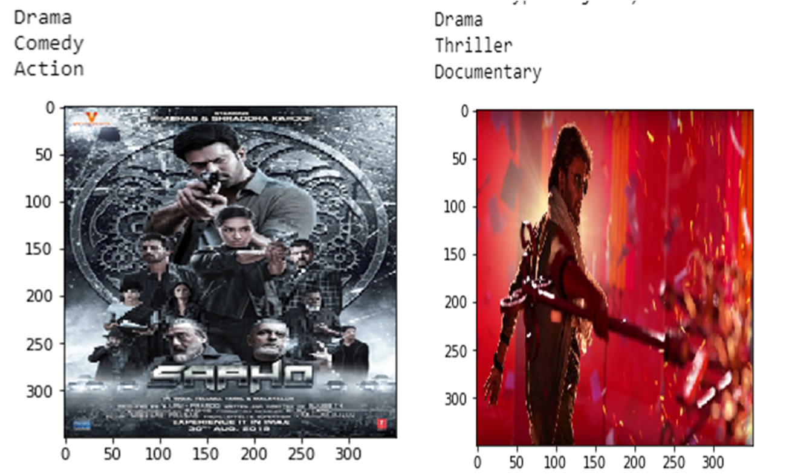
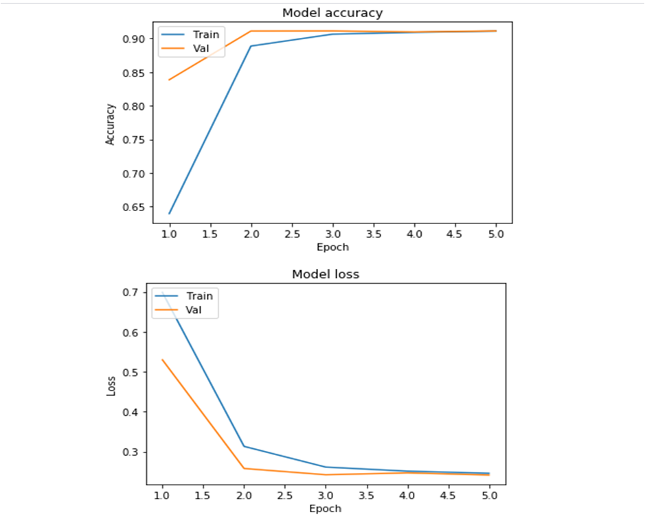

# Movie poster genre classification using CNN
#### Thirumurugan Ramar

#### Developed a CNN model using Keras and tensorflow which can predict the genre of a movie based on its poster.This model has an accuracy of 91%,(trained 5 epochs,approx 45 mins to train the model).

# Model curves:

# Reference:
->https://www.cs.ccu.edu.tw/~wtchu/projects/MoviePoster/index.html 
